# BRA-EUR-2026-30DayChallenge

workspace for the 2026 edition of the 30-Day-Challenge on data visualisation

Our goal is to -- ideally -- submit a (simple) chart every day! 

Rules of engagement:

* Read the prompt of the day.
* Pick any data you like ==> BRA-EUR comparison data
* Pick whatever tool and data you like. ==> in our case mostly ggplot2
* Share your work!
  + publish on LinkedIn or bluesky app
  + tag #30DayChartChallenge AND the day (#Day1)

And if you manage less than 30, that's fine, too! ❤️

This year's prompt for the 30-Day-Chart-Challenge are as follows:

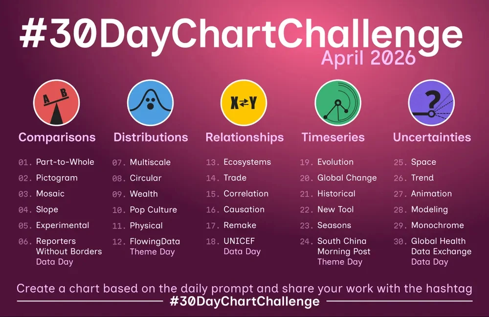

## Progress

### Day 1 - "part-to-whole"

A late decision to participate - literally the night before - made it a bumpy start.
With our Day 1 contribution we want to (combine and) show the scale difference in traffic volume and the associated share of flights between both regions.
Focussing on "regional departures" (as a part of the whole traffic volume) how these shares stay constant or vary between Brazil and Europe.

Conceptual building blocks

* traffic volume ~ standard bar chart, i.e., geom_col() with respective scales to depict 'millions' of flights
* left bottom := share (Brazil) & right bottom := share (Europe)
* we used {patchwork} and its 'design' specification to combine the 3 building block plots
* provided some explanatory text using title, subtitle, and caption

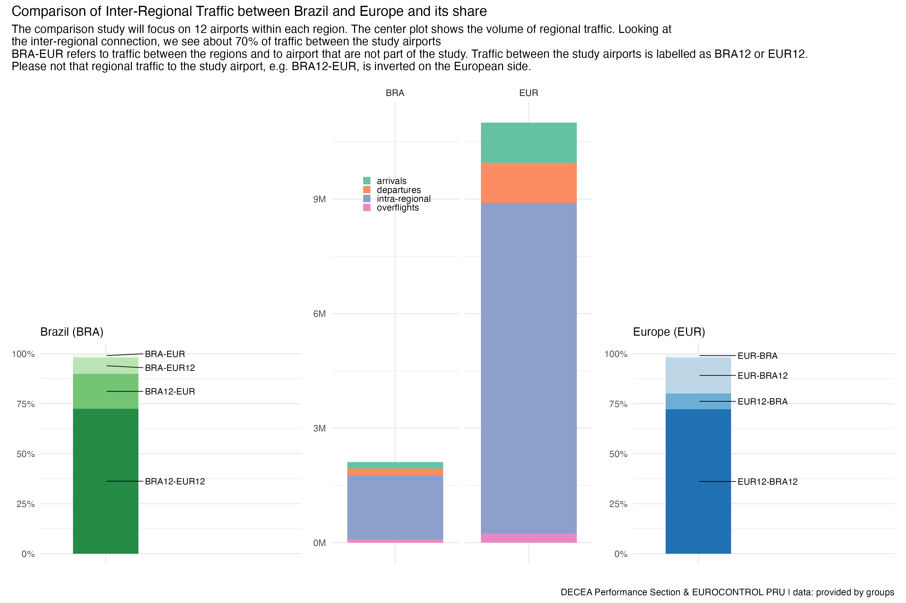

### Day 2 - "pictogram"

The pictogram graph uses fontaweseom to plot the aeroplane icon.
We present the share of punctuality for both regions.

Conceptual building blocks

* traffic data from study data
* the underlying chart is a waffle plot, i.e., x-y cells for which we need to build an index of "postions"
* geom_text() uses the icon as label, i.e., we "print" the icon multiple times
* rotating the icon is done per angle 180deg
* labs are placed and wrapped with ggtext::textbox_simple() and the associated parameters.
* extensive use of theme to place title, subtitle, strip bands, and payload.

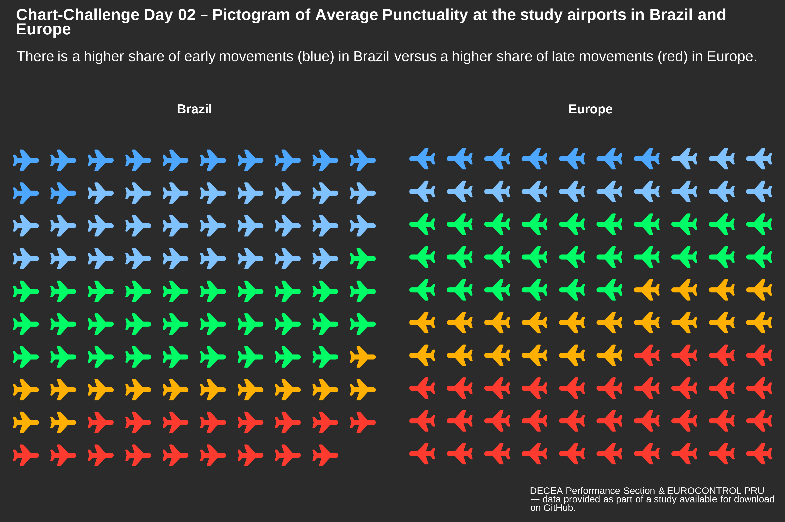

### Day 3 - "mosaic"

TODO - Some explanatory notes to follow 

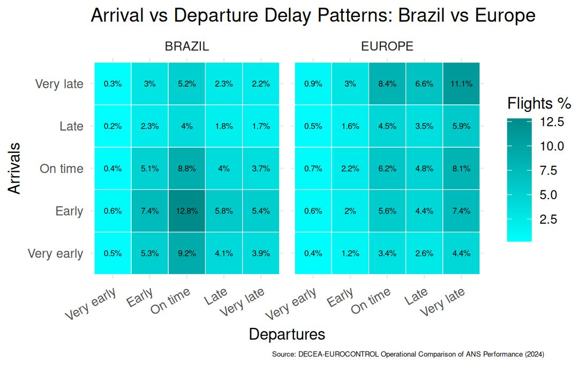

### Day 4 - "slope"

### Day 8 - "circular"

We show the total amount of flights between the study airports in both regions.
As we were unable to make a chord diagram work, we reverted to {ggraph} using a **circular** presentation of the network nodes.
Links are depicted with *geom_arc()*.
The annotations use the standard tools provided by {ggtext} and {showtext}.

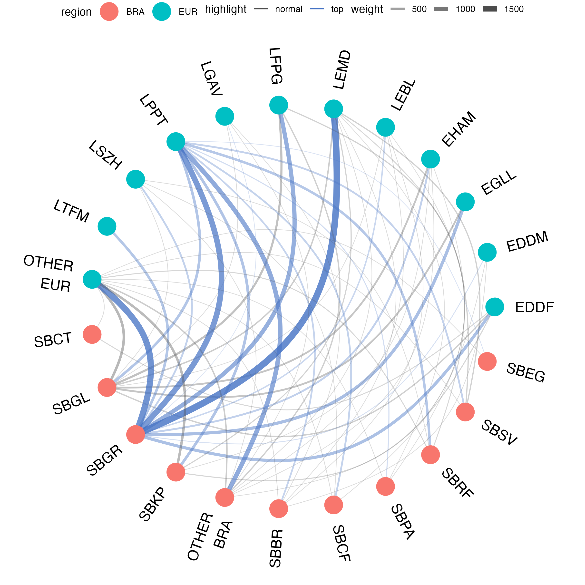

### Day 9 - "multi-scale"

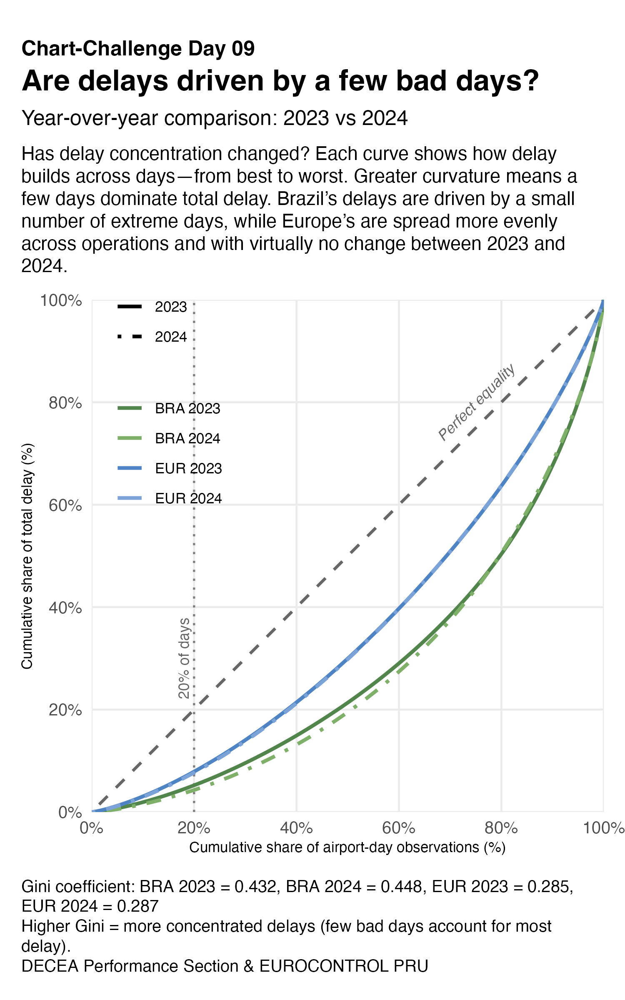

### Day 10 - "pop-culture"

Thread-wise this was one of the most difficult graphics so far. It took us quite a while to come up with an idea.    
The grpah shows the share of aircraft types operated in 2025 between Brazil and Europe.
It shows the main widebody working horses ... and adds a twist in terms of the Millennium Falcon!

* barchart of shares as "pseudo-lollipop"
* aircraft icons/images integrated with geom_image()
* initial use of google fonts to underscore the theme/message

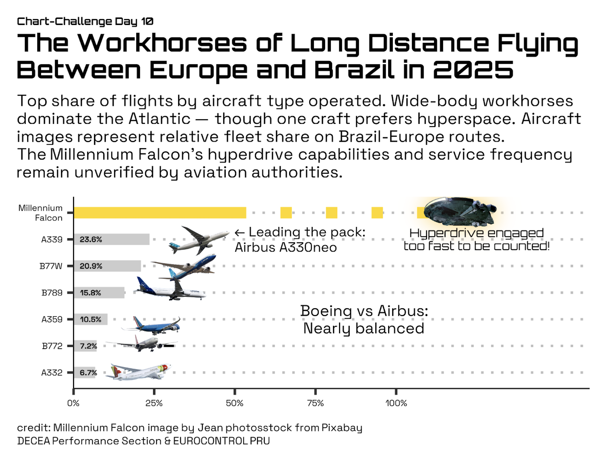

### Day 12 - "flow"

For Day 12 we used a parallel-sets style flow chart to show how air transport services between Europe and Brazil in 2025 concentrate around a relatively small study network. The final chart highlights that 74% of services connect study airports at both ends, with Lisbon, Madrid, and Paris CDG leading on the European side and Guarulhos, Galeao, and Campinas absorbing the largest shares in Brazil.

Conceptual building blocks

* `geom_parallel_sets()` and `geom_parallel_sets_axes()` from `{ggforce}` for the flow geometry
* airport aggregation into study airports plus `Other European airports` / `Other Brazilian airports`
* `{ggtext}` and `{ggview}` for the final title, subtitle, caption, and output sizing
* outside airport labels with `{ggrepel}` and in-block service counts for the larger nodes

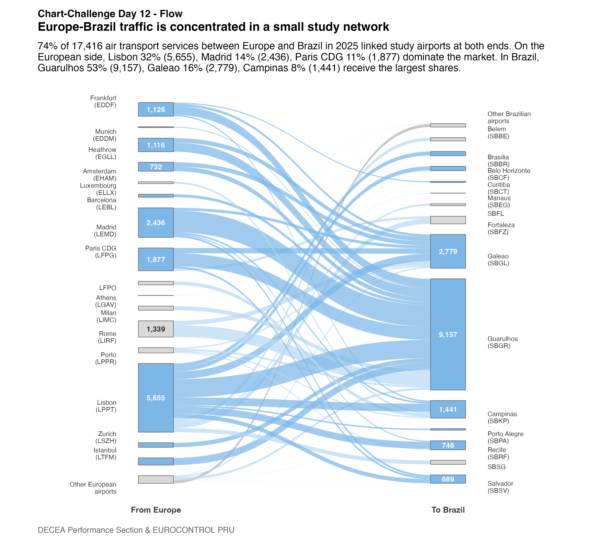

### Day 13 - "ecosystem"

For Day 13 we interpreted airports as local ecosystems. The final candidate is a layered scatter plot where ecosystem richness is measured by the number of destinations served, average delay indicates systemic health, point size shows flight volume, point fill shows international exposure, and the outline color identifies the region. The chart suggests that the larger and more outward-facing airport ecosystems tend to sit higher on delay, while several Brazilian airports cluster in more specialized and stable niches.

Conceptual building blocks

* airport ecosystem richness from distinct destinations in the 2025 traffic data
* average delay across all flights from the binned punctuality distributions
* a layered `geom_point(shape = 21)` design to separate international exposure from region
* regime shading and labelled trend lines to support the ecosystem metaphor without overwhelming the payload

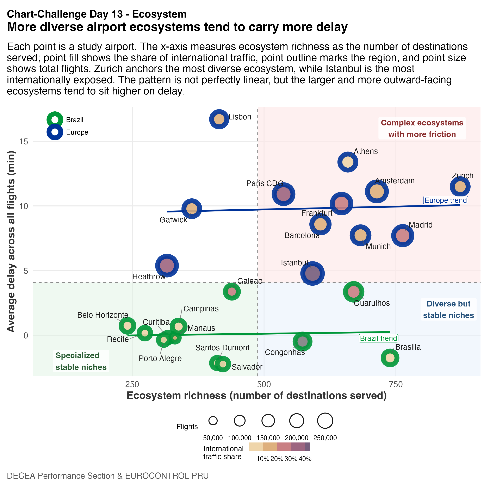

### Day 16 - "simple causal graph + evidence panels"

For Day 16 we used a deliberately modest causal story: daily demand can create traffic pressure, and higher traffic pressure is consistent with more delay. The chart keeps the hypothesis and the evidence close together. A small directed graph labels which links are directly observed, which are simple proxies, and which remain interpretation; two evidence panels then show the airport-day association and the thicker delay tail on higher-pressure days.

Conceptual building blocks

* daily airport movements from `EUR-apt-tfc-2025.csv`
* binned punctuality outcomes from `PBWG-EUR-punc-2025.csv`
* a within-airport traffic pressure percentile to compare busy and quiet days fairly
* `{ggraph}` / `{tidygraph}` for the causal sketch
* `{patchwork}`, `{ggtext}`, and `{ggrepel}` for evidence panels, paragraph-style text, and selected outlier labels

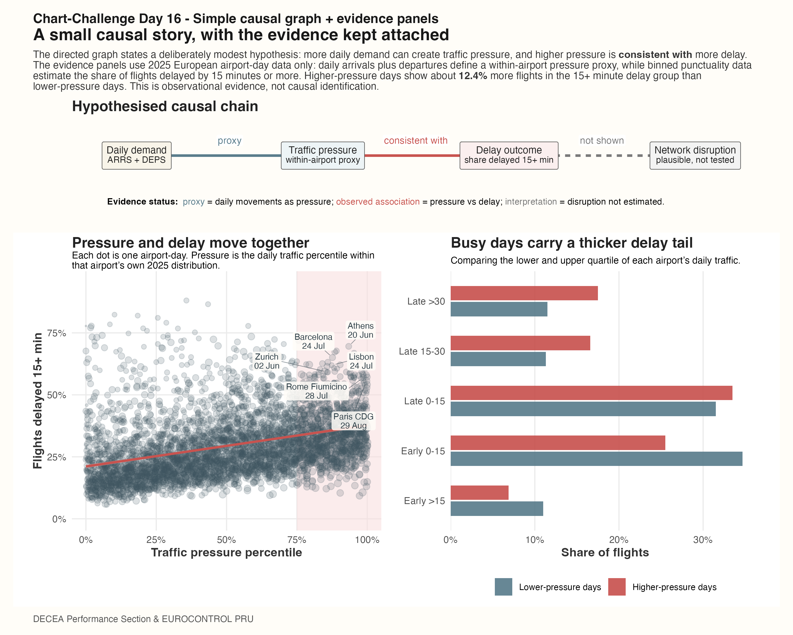

### Day 19 - "evolution"

For Day 19 we interpreted evolution as the recovery arc of air traffic after the COVID shock. The chart compares Brazilian and European daily network traffic from 2019 to 2025, indexing each region to its own 2019 median so that their recovery paths can be compared on a common scale. Daily dots preserve the operational texture, while the 7-day rolling median shows the broader trajectory.

Conceptual building blocks

* European daily network traffic rebuilt from the PBWG archive, including the 2019, 2020, and partial 2024 fix files
* Brazilian daily network traffic from the 2025 Brazil-Europe data archive
* a regional 2019 median baseline, with traffic shown as an index where 2019 median = 100
* daily scatter points plus a centered 7-day rolling median line
* `{ggtext}` and `{ggview}` for the final title, subtitle, caption, and output sizing

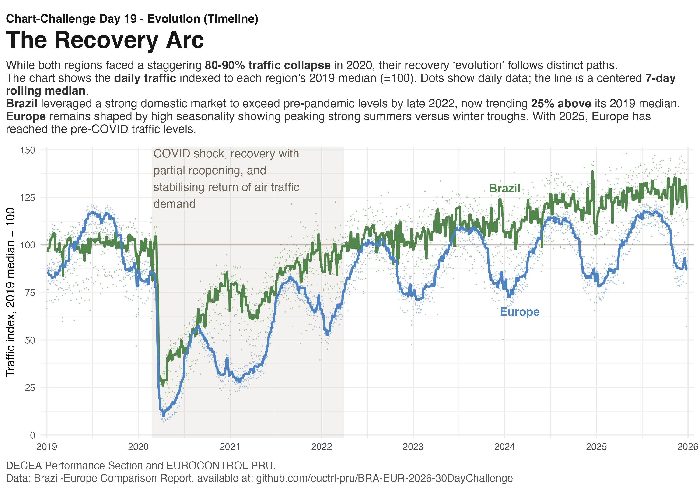

### Day 20 - "global change"

For Day 20 we interpreted global change as a quiet operational drift in taxi-out time. The chart compares monthly departure taxi-out times across the Brazil and Europe study airports from 2023 to 2025. Each regional line shows the median airport-month, while the shaded band summarizes the interquartile range of daily airport medians. The result is a small but persistent divergence: Europe drifts upward, while Brazil remains broadly steady.

Conceptual building blocks

* daily taxi-out aggregates for 12 study airports per region, archived for 2023, 2024, and 2025
* airport-month summaries built from daily departure taxi-out time
* regional medians across airports, with IQR bands to show within-month predictability
* key-message panels showing the 2023-to-2025 change for each region
* `{patchwork}`, `{ggtext}`, and `ggsave()` for the final publication layout and export

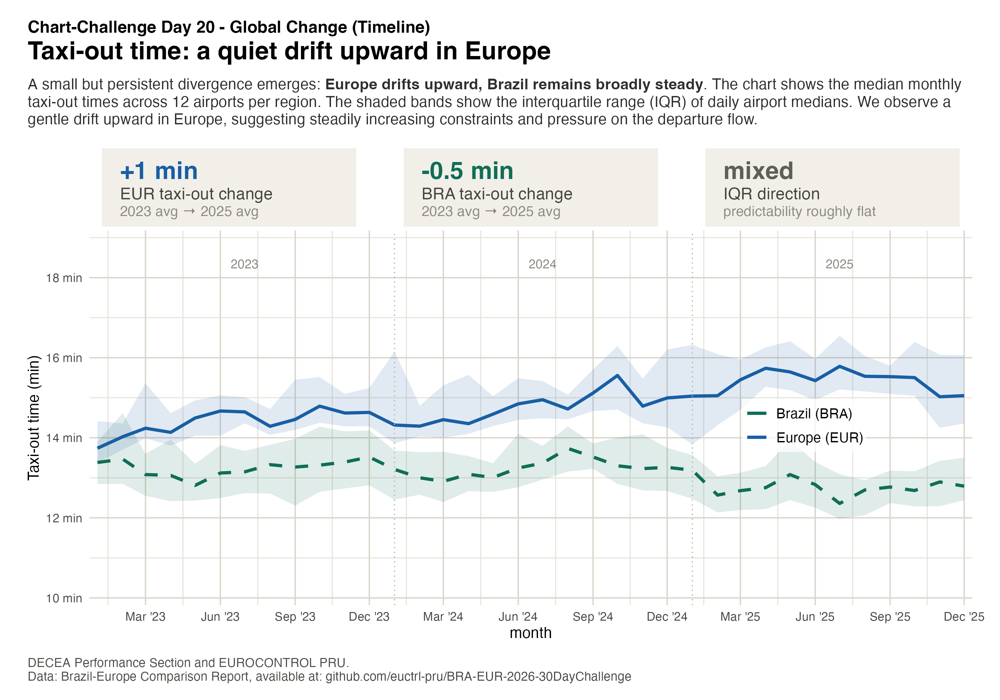

### Day 22 - "new tool"

For Day 22 we used animation as the new tool. The chart compares the seasonal delay pulse of Brazilian and European study airports from 2023 to 2025. Delay is estimated from the airport punctuality bins by assigning each bin its midpoint and calculating average positive delay per flight. The final GIF highlights selected airports while the black line shows the weighted regional average.

Conceptual building blocks

* binned airport punctuality data for Brazil and Europe, 2023-2025
* midpoint-based average positive delay per flight
* 7-day rolling delay smoothed into weekly seasonal profiles
* selected airport highlights for `SBGR`, `SBGL`, `SBBR`, `EGLL`, `EDDF`, and `LPPT`
* `{magick}` to stitch yearly frames into a lightweight animated GIF

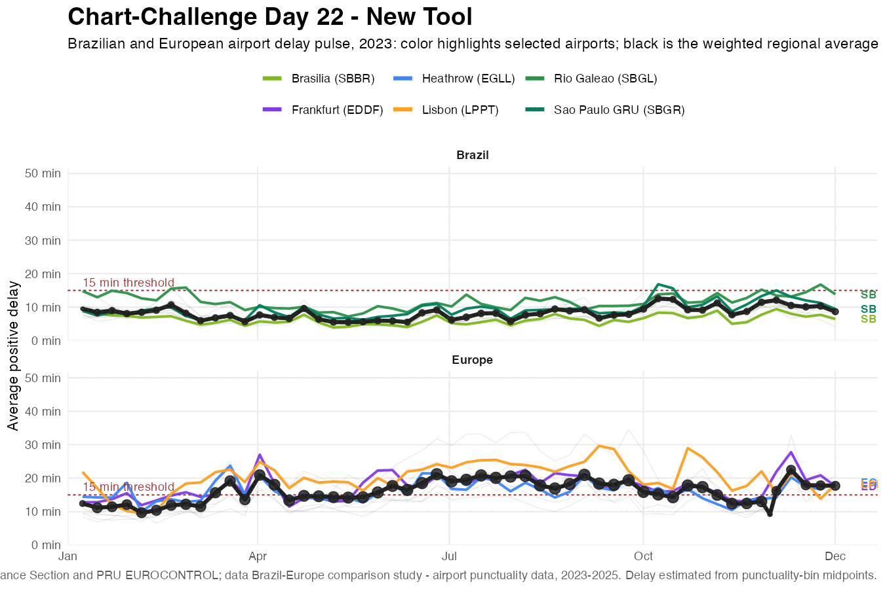

### Day 24 - "South China Morning Post"

For Day 24 we treated the prompt as a source challenge rather than as a ready-made downloadable dataset. We assembled a small reference CSV from public COMAC product pages, COMAC news releases, and one recent South China Morning Post article on the C919 delivery slowdown. The final chart compares the `C909` and `C919` across their seat-range design envelope, their current public operational scale, and the latest SCMP signal that only three C919 aircraft were delivered in the first quarter of 2026.

Conceptual building blocks

* a manually assembled public-facts CSV with one published fact per row and source URLs included
* aircraft design envelopes shown as seat-range rectangles to distinguish the regional-jet and narrowbody segments
* small-multiple operational comparisons for cumulative deliveries and passengers carried
* a compact SCMP callout panel to anchor the chart in the Day 24 prompt

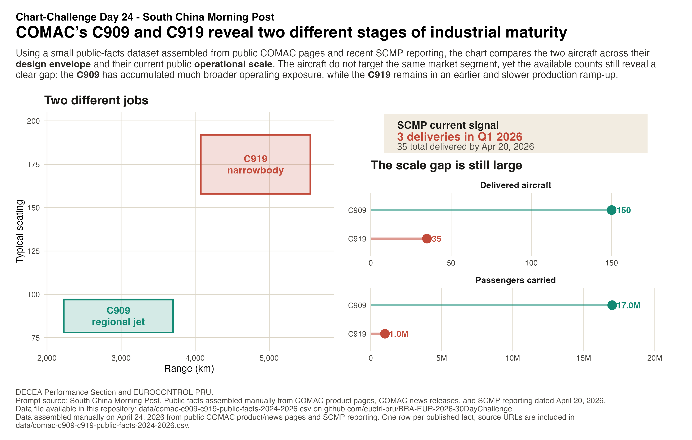

### Day 25 - "space"

For Day 25 we interpreted space as the runway and apron system occupied during taxi-out. Rather than plotting taxi-out time directly, the final chart focuses on uncertainty: the extra taxi-out minutes above the reference expectation. Grouping airport-days into demand bands lets the chart compare how unexpected occupation rises as departure volume increases in Brazil and Europe.

Conceptual building blocks

* daily departure taxi-out aggregates for the 2025 Brazil and Europe study airports
* uncertainty defined as `actual taxi-out - reference taxi-out` per departure
* demand bands built from airport-day departure movements to show how unpredictability changes with traffic pressure
* median line plus 90th-percentile ribbon to separate the typical signal from the disruption tail
* a message row linking per-flight uncertainty to the system-wide extra occupied ground-time on the busiest demand bands

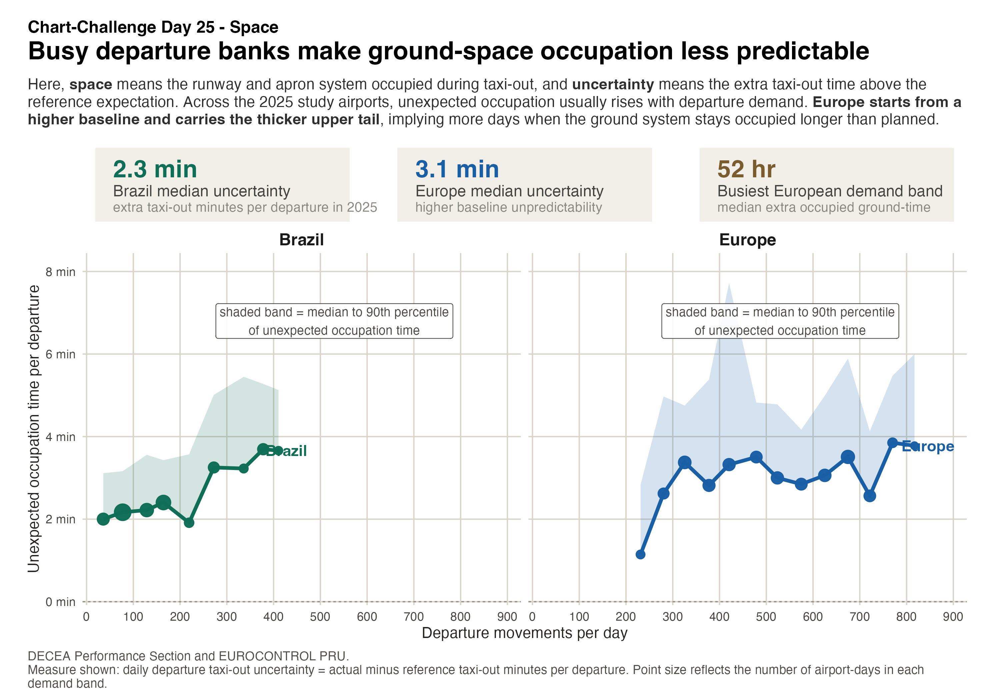

### Day 26 - "trend"

For Day 26 we used trend in the most direct operational sense: how did taxi-out predictability move from 2023 to 2025 across the 12 Brazilian and 12 European study airports? The final chart compares each airport's 2023 and 2025 average taxi-out uncertainty, defined as actual minus reference taxi-out minutes per departure. The regional contrast is striking: most Brazilian airports move toward lower uncertainty, while almost every European airport moves the other way.

Conceptual building blocks

* daily departure taxi-out aggregates for the 2023-2025 study airports
* uncertainty defined as `actual taxi-out - reference taxi-out` per departure
* airport-level averages for 2023 and 2025 connected with directional segments
* opposite color semantics for improving versus worsening predictability
* message tiles summarising how many airports trend up or down in each region

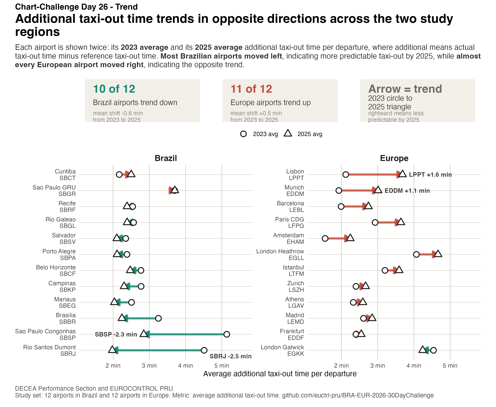

### Day 27 - "animation"

For Day 27 we used animation to compare the daily clocks of the Brazilian and European study-airport networks. Rather than animating geography directly, the final chart tracks the busiest bidirectional airport-pair corridors in each region through the UTC day. The moving hour marker shows when each corridor lights up, while the lower profile summarizes what share of all kept corridor traffic falls into each hour. The result is a clean timing contrast: Europe peaks earlier on the UTC clock, while Brazil's strongest domestic corridors build later and remain elevated much deeper into the UTC day.

Conceptual building blocks

* `July 2025` departures only, restricted to study-airport to study-airport movements
* bidirectional airport-pair corridors, ranked by July traffic within each region
* corridor-hour heatmaps for the top corridor set in Brazil and Europe
* animated UTC-hour outline to guide attention across the day
* lower step-line profile showing each hour's share of all kept corridor flights

### Day 30 - "Global Health Data Exchange"

For Day 30 we used the Global Health Data Exchange as a human-factors lens on the Brazil-Europe comparison study. The chart compares the busiest 2025 study-airport corridors in both directions, showing arrival density on the destination-local clock. The shaded band marks the Window of Circadian Low (WOCL), roughly 02:00-06:00, and the result is a fitting final note: in both directions, about three in ten arrivals fall inside that fatigue-relevant window.

Conceptual building blocks

* 2025 long-haul arrivals between the Brazil and Europe study airports
* bidirectional comparison of `Brazil -> Europe` and `Europe -> Brazil`
* destination-local arrival time, including local time zones at each receiving airport
* ridgeline densities for the busiest corridors in each direction
* GHDx / IHME Global Burden of Disease sleep-disorders data as the health-data frame for the human-factors story

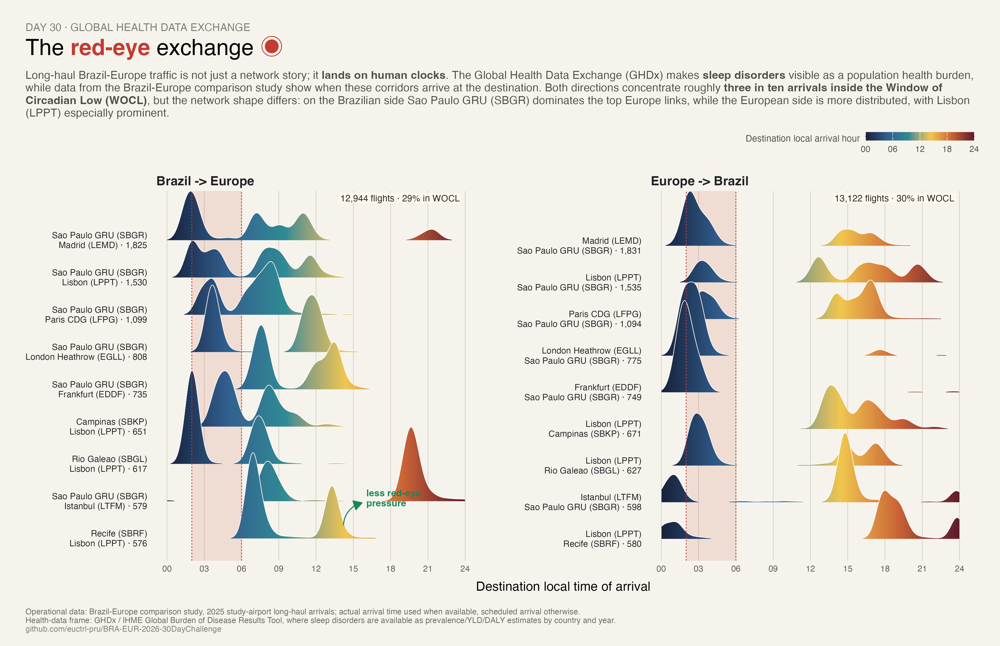
